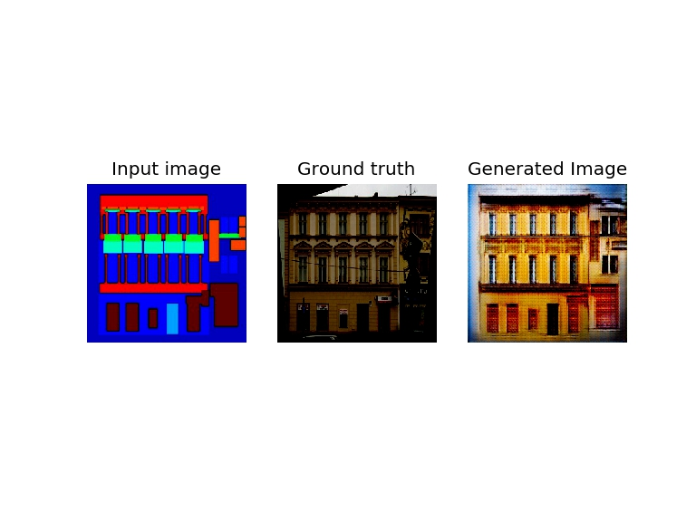
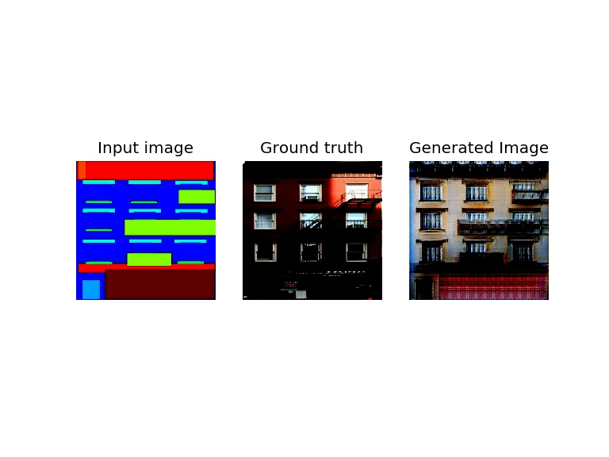
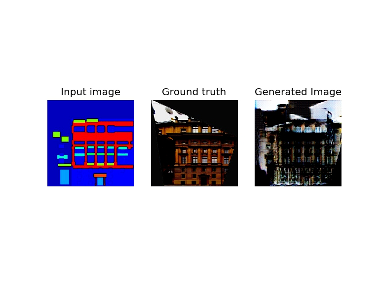
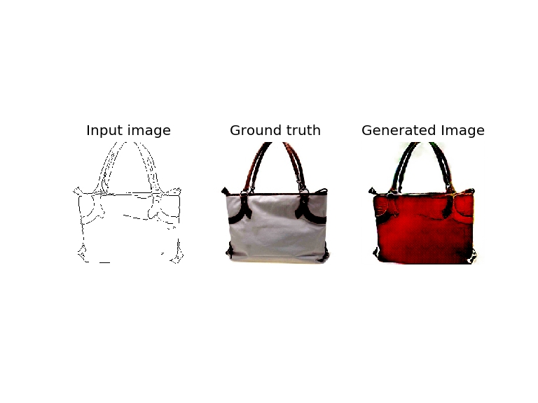
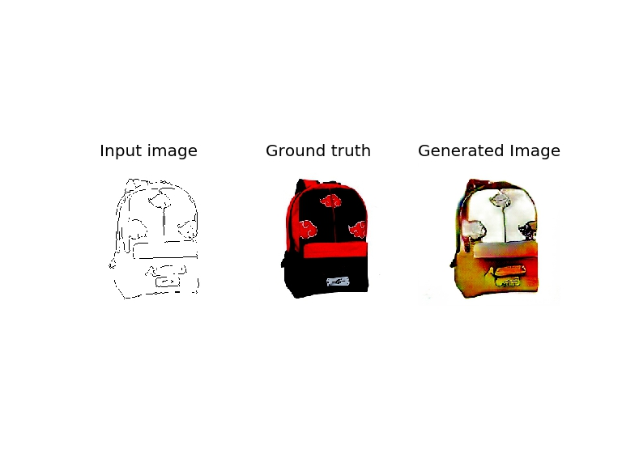
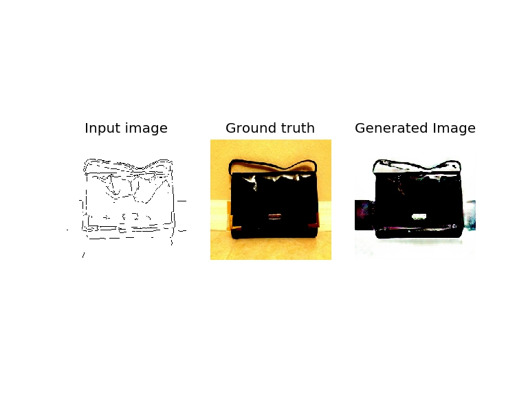
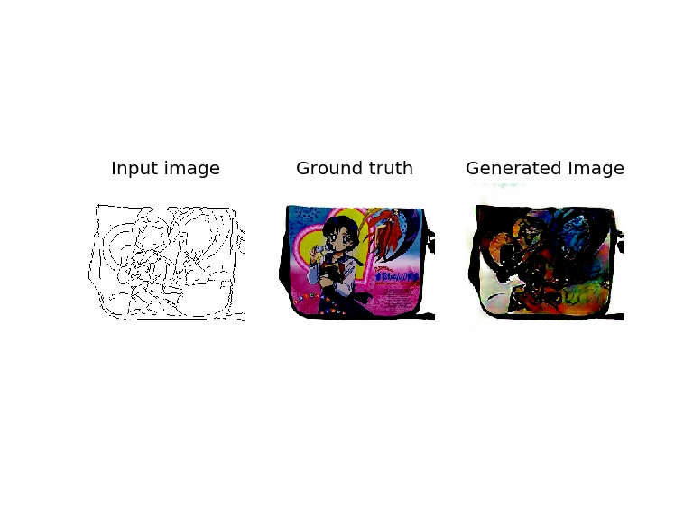
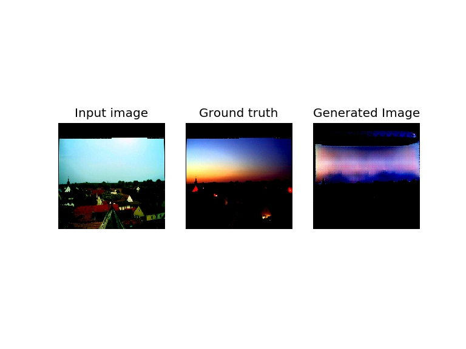

# Image to Image Translation with Conditional Adversarial Network 图像翻译条件对抗网络

这个项目是以Tensorlayer实现的[Image to Image Translation with Conditional Adversarial Network ](https://arxiv.org/abs/1611.07004).

## 模型

## 参数

## 要求

``` sh
python 3.7.3
numpy 1.16.0
pandas 0.25.3
matplotlib 3.1.2
tensorflow-gpu 2.0.0
tensorlayer 2.1.0
opencv-python 4.1.2.30
```

## 使用方法

### 准备数据

TODO: fill this section

如果你只想使用我们已经训练好的权重，进行检验

```sh
cd src
./install.sh
```

install.sh脚本将自动创建model文件夹，并下载解压权重。

### 训练

``` sh
python train.py dataset [-v] [-g] [-e EPOCH] [--gpu=GPU]
```

其中，dataset为数据集的名字，-v选项为详细输出，-g选项为绘制loss折线图，-e选项为指定Epoch数，--gpu选项为指定使用的GPU。

训练好的权重会以hdf5格式存在`.\model\G_model_dataset.hdf5`和`.\model\D_model_dataset.hdf5`里面，其中dataset是输入的数据集名字。第一次训练之前需要先`mkdir model`。

### 查看结果

``` sh
python evaluate.py dataset [-t train/test] [-i index1 [index2 ...]] [--gpu=GPU]
```

其中，dataset是数据集的名字，-t选项可以指定查看训练集还是测试集（默认为测试集），-i选项可以指定查看的图片编号列表（默认为全部），--gpu选项可以指定使用的GPU。

evaluate.py会将指定的数据集中指定的图片取出，使用训练好的生成器获得对应的输出，将输入、标签和输出排列好后以图片格式储存到以数据集命名的文件夹里面。需要提前`mkdir`。

## 结果

我们在facades数据集、edges2shoes数据集和edges2handbags数据集上取得了较好的成果。

facades数据集的输入是建筑的表面布局，输出是建筑物的正面图片。





其中大部分能输出较好的建筑正面，但是也出现了一些问题：



数据集中有不少图片是有缺陷的，我们的分类器不够鲁棒，没法很好地理解标签图中的缺陷。数据增强能减轻图片缺陷的问题，但是不能消除这个问题。

edge2handbags数据集的输入是各种包的线图，输出是实物的照片。





鲁棒性依然是问题，如下图中背景不够干净时，会出现多余的东西。



以及领域相关的问题：学不出包上的人脸图像，凡是出现人脸时效果都不好。



在night2day数据集上，我们的效果比较不好。night2day数据集的输入是白天的图片，输出是同一位置夜晚的图片。由于建筑物较暗，而天空较亮，基本只学到了天空的部分。


